# Sentiment Analysis on Healthcare Reviews in Abuja

This project aims to perform sentiment analysis on healthcare-related reviews collected from Google Maps. The reviews are stored in multiple JSON files, which will be merged into a single dataset for analysis.
This project uses Transformer Pipeline Model from Hugging Face

## Project Structure

- **data/**: Contains the JSON files with healthcare reviews.
  - `dataset_google-maps-reviews-1.json` to `dataset_google-maps-reviews-46.json`: Each file contains reviews with fields such as title, stars, name, text, neighborhood, location, categoryName, city, and publishAt.

- **notebooks/**: Contains Jupyter notebooks for documentation and experimentation.
  - `book.ipynb`: A notebook for running experiments related to sentiment analysis.

- **requirements.txt**: Lists the dependencies required for the project, such as pandas and libraries for sentiment analysis.

## Setup Instructions

1. Clone the repository to your local machine.
2. Navigate to the project directory.
### Running notebook in Vscode
3. Create a virtual environment:
    ```
    py -m venv venv
    ```
4. Install the required dependencies using:
   ```
   pip install -r requirements.txt
   ```

for further instructions, check <a href = "https://code.visualstudio.com/docs/datascience/jupyter-notebooks" target = "_blank_" > Jupyter Notebooks in Vscode</a>

## Usage

- Follow `notebook/book.ipynb` it contains a step by step process for this project.

## Visualization on the Analysed Data

1. Overall Sentiment Distribution - Bar Chart
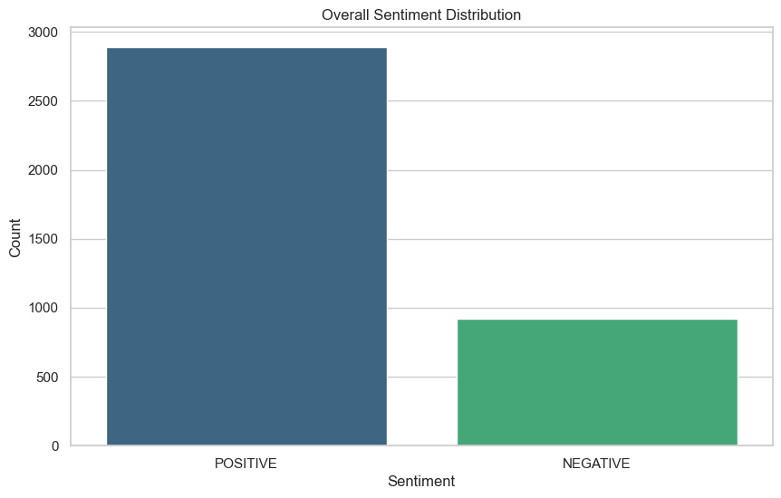
This chart shows the distribution of positive and negative sentiments across all reviews. It provides an overview of the general sentiment polarity in the dataset.

2. Overall Sentiment Distribution - Pie Chart
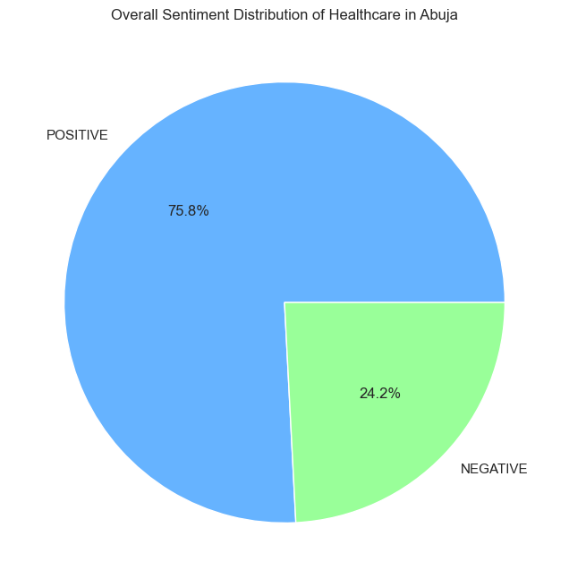
This pie chart visualizes the proportion of positive and negative sentiments in the dataset. It gives a quick glance at the sentiment breakdown.

3. Sentiment over Time - Line Chart
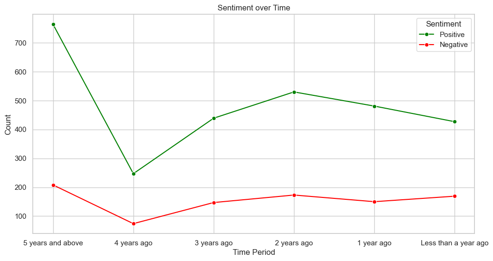
This line chart tracks the changes in positive and negative sentiments over different time periods. It helps identify trends in sentiment over time.

4. Sentiment over Time - Bar Chart
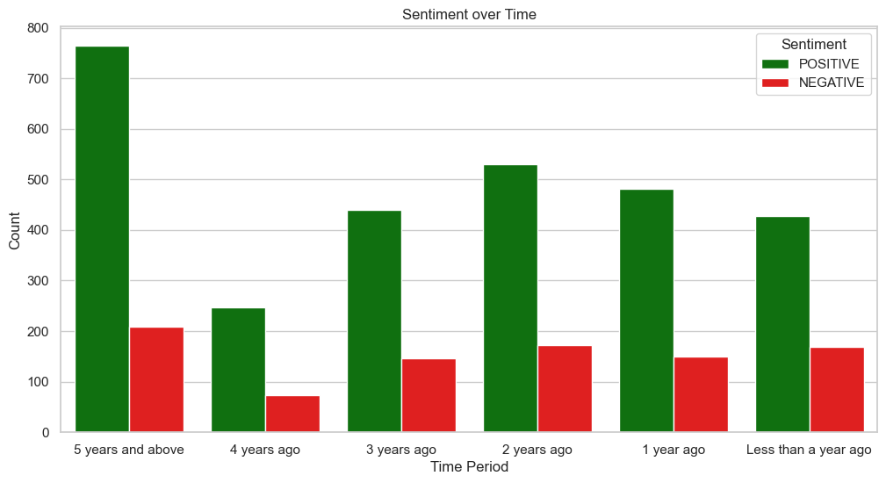
This bar chart shows the count of positive and negative sentiments for each time period. It provides a clear comparison of sentiment distribution over time.

5. Distribution of Sentiment for Each Star Rating - Bar Chart
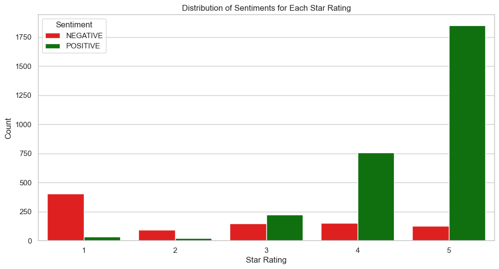
This bar chart shows the count of positive and negative sentiments over the rating, given to each review. It provides a clear comparison of the sentiment analysed and the rating given to a review.

6. Sentiment Distribution across Categories - Bar Chart
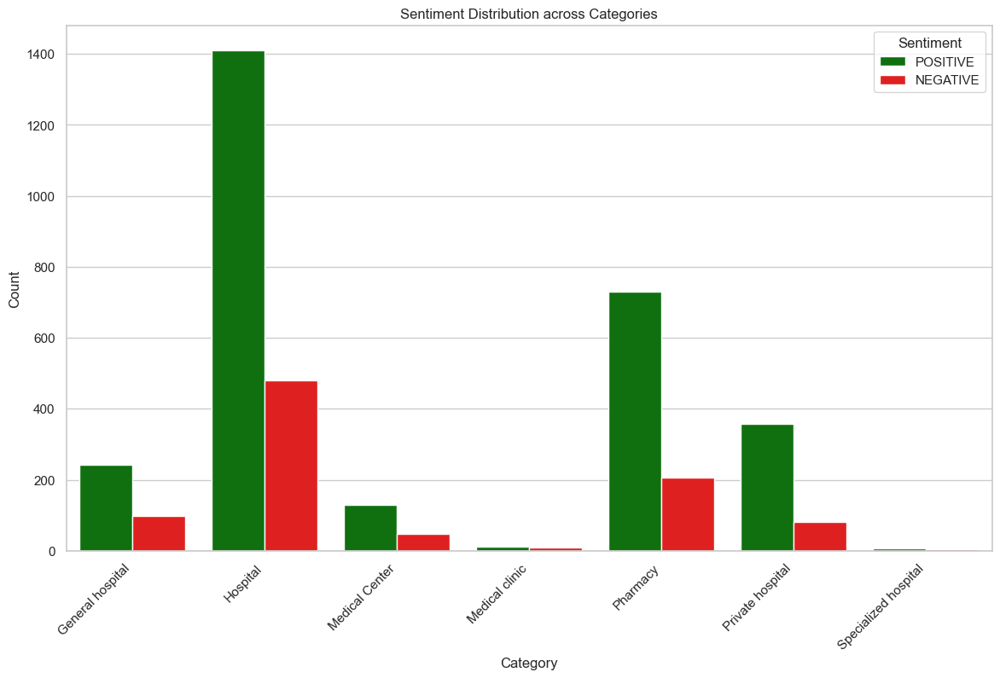
This bar chart visualizes the count of positive and negative sentiments for each category. It highlights how sentiment varies across different categories.

7. Sentiment Distribution across Categories - Line Chart
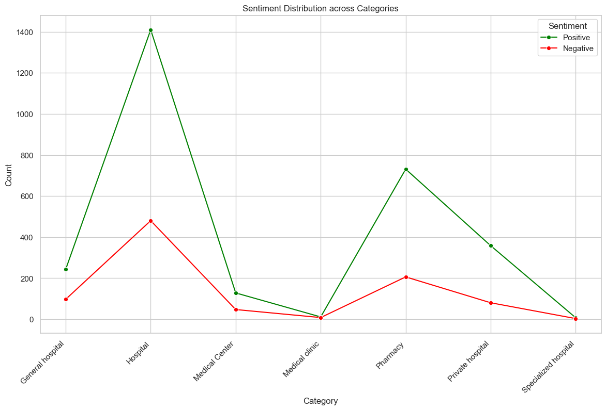
This line chart shows the count of positive and negative sentiments for each category. It provides a trend view of sentiment distribution across categories.

8. Sentiment Distribution across Neighborhoods - Bar Chart
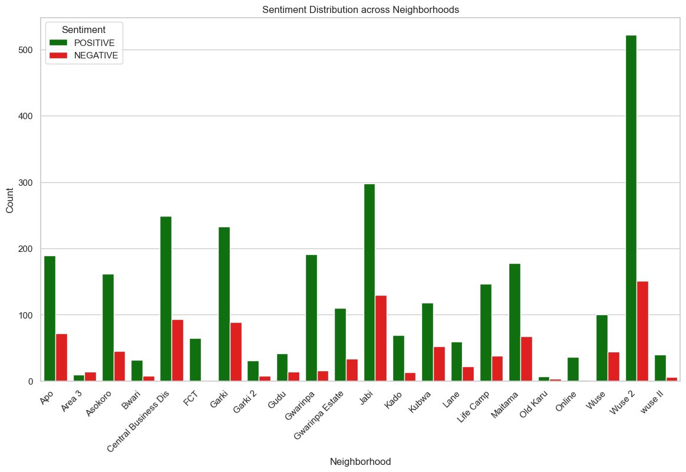
This bar chart visualizes the count of positive and negative sentiments for each neighborhood. It highlights how sentiment varies across different neighborhoods.

9. Sentiment Distribution across Neighborhoods - Line Chart
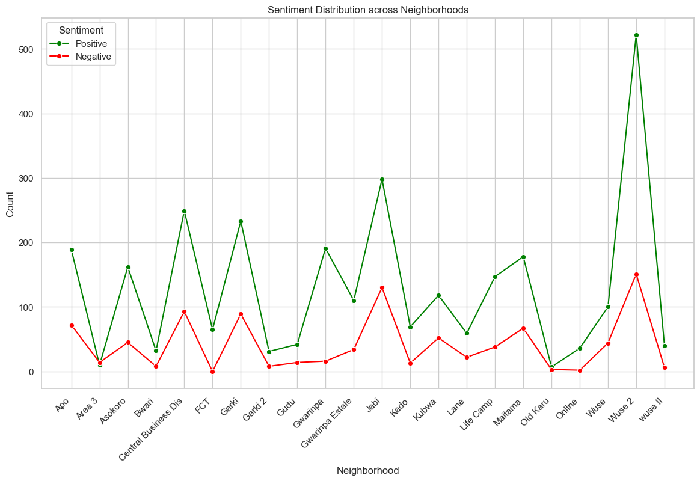
This line chart shows the count of positive and negative sentiments for each neighborhoods. It provides a trend view of sentiment distribution across neighborhoods.

## Performane Metrics

This section documents the performance of the sentiment analysis model using two evaluation approaches: <span style="font-weight: bold">Rating Sentiment Approach</span> and <span style="font-weight: bold">Manual Validation Approach.</span>

1. <span style="font-weight: bold">Rating Sentiment Approach</span>
<br>
In this approach, the star ratings (stars) were used as a proxy for sentiment:
<ul>
  <li style="font-weight: bold">4–5 stars → POSITIVE</li>
  <li style="font-weight: bold">1–2 stars → NEGATIVE</li>
  <li style="font-weight: bold">3 stars → NEUTRAL (excluded from evaluation).</li>
</ul>
The model's predicted sentiment was compared with the sentiment derived from the ratings.

### Metrics

| Metric       | Value   |
|--------------|---------|
| Accuracy     | 90.31%  |
| Precision    | 97.90%  |
| Recall       | 90.40%  |
| F1-Score     | 94.00%  |

### Confusion Matrix

|                 | Predicted Negative   | Predicted Positive   |
|-----------------|----------------------|----------------------|
| Actual Negative | 497                  |56                    |
| Actual Postive  | 277                  |2607                  | 

### Rating Sentiment Confustion Matrix
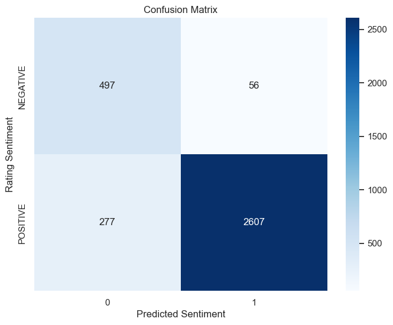

### Classification Report

| Class        | Precision | Recall | F1-Score | Support |
|--------------|-----------|--------|----------|---------|
| Negative     | 64.00%    | 90.00% | 75.00%   | 553     |
| Postive      | 98.00%    | 90.00% | 94.00%   | 2884    |
| Accuracy     |           |        | 90.00%   | 3437    |
| Macro Avg    | 81.00%    | 90.00% | 84.00%   | 3437    |
| Weighted Avg | 92.00%    | 90.00% | 91.00%   | 3437    |

Explanation

<ul>
  <li>
    <span style="font-weight: bold">Accuracy: </span>
    Measures the percentage of correct predictions. A high accuracy indicates that the model aligns well with the rating-based sentiment
  </li>
  <li>
    <span style="font-weight: bold">Precision: </span>
    Indicates how many of the predicted positive sentiments are actually positive.
  </li>
  <li>
    <span style="font-weight: bold">Recall: </span>
    Indicates how many of the actual positive sentiments are correctly predicted.
  </li>
  <li>
    <span style="font-weight: bold">F1-Score: </span>
    Balances precision and recall, providing a single metric for overall performance.
  </li>
  <li>
    <span style="font-weight: bold">Confusion Matrix: </span>
    Shows the breakdown of true positives, true negatives, false positives, and false negatives.
  </li>
</ul>
<br>

2. <span style="font-weight: bold">Manual Validation Approach</span>
<br>

In this approach, a random subset of 200 reviews was manually labeled with true_sentiment values (POSITIVE or NEGATIVE). The model's predicted sentiment was compared with these manually labeled sentiments.

### Metrics

| Metric       | Value   |
|--------------|---------|
| Accuracy     | 96.95%  |
| Precision    | 97.55%  |
| Recall       | 98.76%  |
| F1-Score     | 98.15%  |

### Confusion Matrix

|                 | Predicted Negative   | Predicted Positive   |
|-----------------|----------------------|----------------------|
| Actual Negative | 32                   | 4                    |
| Actual Postive  | 2                    | 159                  | 

### Manual Validation Confusion Matrix
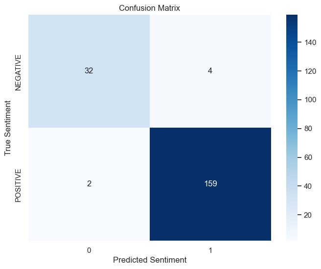

### Classification Report

| Class        | Precision | Recall | F1-Score | Support |
|--------------|-----------|--------|----------|---------|
| Negative     | 94.00%    | 89.00% | 91.00%   | 36      |
| Postive      | 98.00%    | 99.00% | 98.00%   | 161     |
| Accuracy     |           |        | 97.00%   | 197     |
| Macro Avg    | 96.00%    | 94.00% | 95.00%   | 197     |
| Weighted Avg | 97.00%    | 97.00% | 97.00%   | 197     |

Explanation
<ul>
  <li>
    <span style="font-weight: bold">Accuracy: </span>
    The model correctly predicted 96.95% of the sentiments in the manually labeled dataset.
  </li>
  <li>
    <span style="font-weight: bold">Precision: </span>
    Out of all reviews predicted as positive, 97.55% were actually positive.
  </li>
  <li>
    <span style="font-weight: bold">Recall: </span>
    Out of all actual positive reviews, 98.76% were correctly predicted as positive.
  </li>
  <li>
    <span style="font-weight: bold">F1-Score: </span>
    The harmonic mean of precision and recall, indicating strong overall performance.
  </li>
  <li>
    <span style="font-weight: bold">Confusion Matrix: </span>
    Highlights the model's ability to distinguish between positive and negative sentiments
    <ul style="list-style-type:circle">
      <li>
        <span style="font-weight: bold">True Negatives (32): </span>
        Correctly predicted negative sentiments.
      </li>
      <li>
        <span style="font-weight: bold">False Positives (4): </span>
        Incorrectly predicted positive sentiments for negative reviews
      </li>
      <li>
        <span style="font-weight: bold">False Negatives (2): </span>
        Incorrectly predicted negative sentiments for positive reviews.
      </li>
      <li>
        <span style="font-weight: bold">True Positives (159): </span>
        Correctly predicted positive sentiments.
      </li>
    </ul>
  </li>
</ul>

## Comparison of Approaches

| Metric       | Rating Sentiment Approach | Manual Validation Approach |
|--------------|---------------------------|----------------------------|
| Accuracy     | 90.31%                    | 96.95%                     |
| Precision    | 97.90%                    | 97.55%                     |
| Recall       | 90.40%                    | 98.76%                     |
| F1-Score     | 94.00%                    | 98.15%                     |

## Exported File
For further analysis, a copy of the cleaned dataset have been exported and can be viewed under:
```
file/cleaned_data.csv
```

## Contributing

Contributions are welcome! Please feel free to submit a pull request or open an issue for any suggestions or improvements.